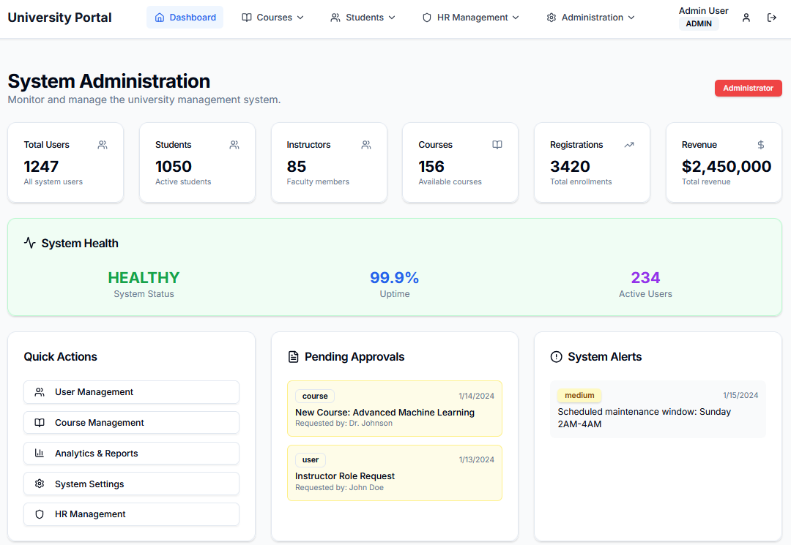

# University ERP System

A comprehensive Enterprise Resource Planning (ERP) system built for university course management with modern web technologies.

## Live Demo

[](https://university-erp.madusha.dev)

[](https://opensource.org/licenses/MIT) [Live Demo](https://university-erp.madusha.dev)


## Demo Credentials

| Role | Username | Password |
| ---- | -------- | -------- |
| Admin | admin | password |
| Student | john_doe | password |
| Instructor | dr_smith | password |


## Features

### Core Functionality
- **User Management**: Students, Instructors, and Admin roles with secure authentication
- **Course Management**: Complete course creation, enrollment, and management
- **Registration System**: Student course registration with payment tracking
- **Analytics Dashboard**: Real-time insights and reporting
- **Department Management**: Multi-department support with analytics

### Technical Features
- **Secure Authentication**: JWT-based auth with refresh tokens
- **Real-time Analytics**: Interactive dashboards with charts
- **Responsive Design**: Mobile-first approach with modern UI
- **Performance Optimized**: Smart caching and optimized API calls
- **Error Handling**: Comprehensive error boundary and recovery
- **Toast Notifications**: User-friendly feedback system

## Technology Stack

### Backend
- **Spring Boot 3.5.3** - Main framework
- **PostgreSQL** - Database
- **Spring Security** - Authentication & Authorization
- **Spring Data JPA** - Data access layer
- **Flyway** - Database migrations
- **Maven** - Build tool

### Frontend
- **Next.js 15.4.1** - React framework
- **TypeScript** - Type safety
- **Tailwind CSS** - Styling
- **Zustand** - State management
- **Recharts** - Data visualization
- **React Hook Form** - Form handling
- **Package Manager**: pnpm
- **Containerization**: Docker & Docker Compose

## Features

- ✅ User authentication and authorization
- ✅ Role-based access control (Student/Admin)
- ✅ Course management (CRUD operations)
- ✅ Student enrollment system
- ✅ Grade management
- ✅ Responsive UI with modern design
- ✅ API documentation with OpenAPI/Swagger
- ✅ Comprehensive testing
- ✅ CI/CD pipeline ready

## Project Structure

```
erp-app/
├── backend/                 # Spring Boot application
│   ├── src/main/java/
│   ├── src/main/resources/
│   ├── src/test/
│   ├── pom.xml
│   └── Dockerfile
├── frontend/                # Next.js application
│   ├── src/
│   ├── public/
│   ├── package.json
│   └── Dockerfile
├── docker-compose.yml       # Local development setup
├── .github/workflows/       # CI/CD pipelines
└── docs/                   # Documentation
```

## Development Setup

### Prerequisites

- Java 17+
- Node.js 18+
- PostgreSQL 16 (or use Docker)
- Docker & Docker Compose (optional)
- pnpm

### Local Development

1. **Clone the repository**
   ```bash
   git clone <repository-url>
   cd erp-app
   ```

2. **Backend Setup**
   ```bash
   cd backend
   ./mvnw spring-boot:run
   ```

3. **Frontend Setup**
   ```bash
   cd frontend
   pnpm install
   pnpm dev
   ```

4. **Using Docker Compose**
   ```bash
   docker-compose up -d
   ```

## Deployment

### Production Deployment
- Backend: Deployed on Azure App Service
- Frontend: Deployed on Azure App Service
- Database: PostgreSQL on Aiven Postgres

### Environment Variables

**Backend**
```
DATABASE_URL=jdbc:postgresql://localhost:5432/university_db
DATABASE_USERNAME=postgres
DATABASE_PASSWORD=password
JWT_SECRET=your-secret-key
JWT_EXPIRATION=86400000
```

**Frontend**
```
NEXT_PUBLIC_API_URL=http://localhost:8080
NEXT_PUBLIC_APP_URL=http://localhost:3000
NEXT_PUBLIC_JWT_EXPIRY_TIME=900000
NEXT_PUBLIC_REFRESH_TOKEN_EXPIRY=604800000
```

## API Documentation

Once the backend is running, visit:
- Swagger UI: http://localhost:8080/swagger-ui.html
- API Docs: http://localhost:8080/api-docs

## Testing

### Backend Testing
```bash
cd backend
./mvnw test
```

### Frontend Testing
```bash
cd frontend
pnpm test
```

## Security Features

- JWT authentication with refresh tokens
- Password encryption with BCrypt
- CORS configuration
- Input validation and sanitization
- Role-based authorization
- SQL injection protection

## Development Milestones

- [x] Project initialization and setup
- [x] Backend API development
- [x] Database setup and migrations
- [x] Authentication and authorization
- [x] Frontend development
- [ ] Integration testing
- [ ] Deployment configuration
- [ ] Performance optimization

## License

This project is licensed under the MIT License - see the [LICENSE](LICENSE) file for details.

## Contributors

- [Madusha Sandaruwan] - Initial development

## Support

For support, email [work@madusha.dev] or create an issue in this repository.
